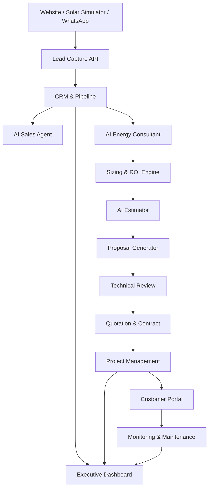

# System Architecture
# DK Power Agentic Energy Business OS

## 1. Architecture Principle

Sistem menggunakan arsitektur modular cloud-native, ringan untuk UKM, tetapi cukup rapi untuk dikembangkan menjadi platform enterprise.

## 2. High Level Architecture

## 3. Application Layers

### Experience Layer

- Website
- Solar simulator
- WhatsApp chat
- Customer portal
- Internal admin portal

### Business Layer

- CRM
- Estimator
- Proposal
- Quotation
- Project management
- Maintenance

### AI Agent Layer

- Sales Agent
- Energy Consultant Agent
- Estimator Agent
- Proposal Writer Agent
- Technical Reviewer Agent
- Project Coordinator Agent
- Monitoring Agent

### Data Layer

- PostgreSQL
- Object storage
- Vector database
- Audit log

## 4. Suggested Tech Stack

| Component | Recommendation |
|---|---|
| Frontend | Next.js, Tailwind, Shadcn UI |
| Backend | NestJS or FastAPI |
| Database | PostgreSQL |
| Auth | Supabase Auth / Auth.js |
| Workflow | n8n |
| AI | OpenAI / Gemini |
| Vector DB | Qdrant / Chroma |
| File Storage | Google Drive / GCS |
| Deployment | Cloud Run / VPS |

## 5. Integration Points

- Website form
- WhatsApp Business API
- Google Drive
- Google Sheets for early price list
- Email SMTP
- PDF generator
- Payment/invoice system in future phase
