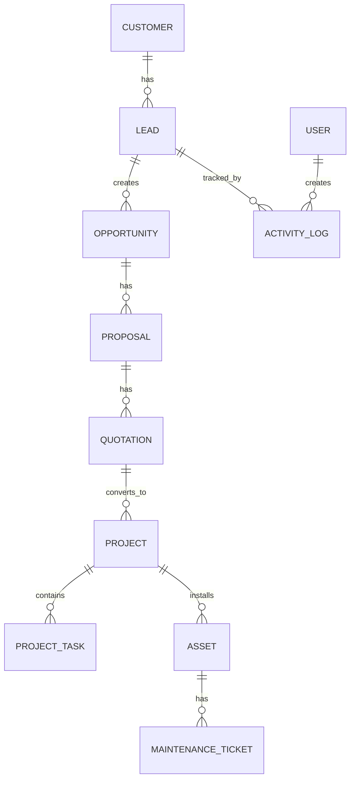

# ERD & Database Design
# DK Power Agentic Energy Business OS

## 1. Core Entities

## 2. Tables

### customers

| Field | Type | Notes |
|---|---|---|
| id | uuid | PK |
| name | text | customer name |
| type | enum | residential, sme, industrial |
| phone | text | WhatsApp number |
| email | text | optional |
| address | text | optional |
| city | text | city |

### leads

| Field | Type | Notes |
|---|---|---|
| id | uuid | PK |
| customer_id | uuid | FK |
| source | enum | website, whatsapp, referral, simulator |
| status | enum | new, contacted, qualified, lost |
| interest | text | solar, battery, ups, genset |
| monthly_bill | numeric | IDR |
| created_at | timestamp | |

### opportunities

| Field | Type | Notes |
|---|---|---|
| id | uuid | PK |
| lead_id | uuid | FK |
| stage | enum | discovery, proposal, negotiation, won, lost |
| estimated_value | numeric | IDR |
| probability | integer | 0-100 |
| expected_close_date | date | |

### proposals

| Field | Type | Notes |
|---|---|---|
| id | uuid | PK |
| opportunity_id | uuid | FK |
| system_size_kwp | numeric | |
| estimated_saving | numeric | IDR/month |
| payback_year | numeric | |
| ai_confidence | numeric | 0-1 |
| approval_status | enum | draft, review, approved, rejected |
| pdf_url | text | |

### projects

| Field | Type | Notes |
|---|---|---|
| id | uuid | PK |
| quotation_id | uuid | FK |
| status | enum | planned, procurement, installation, commissioning, completed |
| start_date | date | |
| target_finish_date | date | |
| actual_finish_date | date | |
