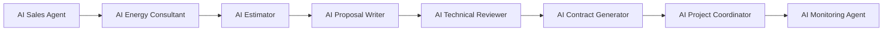

# Agent Design Specification
# DK Power Agentic Energy Business OS

## 1. Agentic AI Principles

- Agents produce draft, not final approval.
- All financial and technical outputs require human validation.
- Every agent must log reasoning summary, inputs, output, and confidence score.
- Agent may ask for missing data before producing proposal.

---

## 2. Agent Map

---

## 3. AI Sales Agent

### Objective

Mengubah percakapan awal menjadi lead yang terstruktur.

### Inputs

- Nama customer
- Nomor WhatsApp
- Lokasi
- Jenis bangunan
- Tagihan PLN
- Masalah utama

### Outputs

- Lead profile
- Qualification score
- Next action

### Guardrails

- Tidak menjanjikan harga final.
- Tidak menjanjikan payback pasti.
- Selalu menyebut bahwa hasil awal bersifat estimasi.

---

## 4. AI Energy Consultant

### Objective

Menganalisis kebutuhan energi dan memberi rekomendasi awal.

### Inputs

- Tagihan listrik
- Daya PLN
- Pola pemakaian
- Luas atap
- Lokasi

### Outputs

- Rekomendasi kapasitas kWp
- Estimasi produksi energi
- Estimasi penghematan
- Payback range

---

## 5. AI Estimator

### Objective

Menghitung kebutuhan material dan biaya awal.

### Outputs

- Jumlah panel
- Kapasitas inverter
- Battery sizing jika hybrid/off-grid
- BOS material estimate
- Installation cost
- Margin check

---

## 6. AI Proposal Writer

### Objective

Menyusun proposal PDF yang rapi dan siap direview.

### Sections

- Executive summary
- Current problem
- Proposed solution
- Technical configuration
- Financial simulation
- Timeline
- Terms & assumptions

---

## 7. AI Technical Reviewer

### Objective

Memeriksa risiko teknis dan kewajaran desain.

### Checks

- kWp vs tagihan
- inverter sizing
- battery sizing
- margin minimum
- site risk
- missing data

### Output Status

- Approved
- Need Revision
- Rejected
