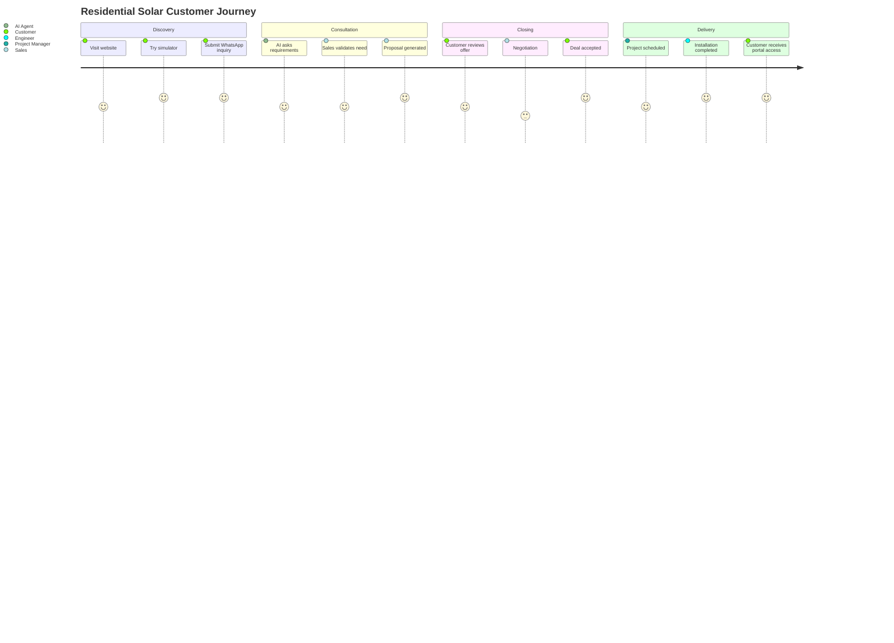

# User Journey
# DK Power Agentic Energy Business OS

## Journey 1: Customer Residential

## Journey 2: SME / Commercial Customer

1. Customer mengisi form atau simulator.
2. AI Sales Agent mengumpulkan data konsumsi dan lokasi.
3. AI Energy Consultant membuat rekomendasi awal.
4. Sales melakukan discovery call.
5. AI Estimator membuat estimasi biaya.
6. Engineer melakukan review.
7. Proposal PDF dikirim.
8. Opportunity masuk tahap negotiation.
9. Quotation final disetujui.
10. Project dibuat otomatis.
11. Customer memantau progress dari portal.

## Journey 3: Internal Sales

1. Buka dashboard lead.
2. Pilih lead baru.
3. Lihat AI lead summary.
4. Klik Generate Recommendation.
5. Klik Generate Proposal.
6. Kirim ke engineer untuk approval.
7. Kirim ke customer.
8. Follow up terjadwal otomatis.
