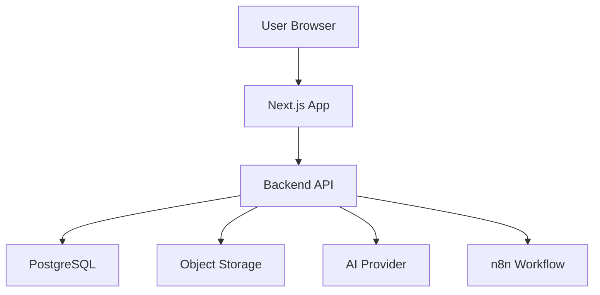

# Deployment Architecture
# DK Power Agentic Energy Business OS

## Option A: Lean MVP Deployment

Recommended for MVP:

- Vercel / Cloud Run for frontend
- Cloud Run / VPS for backend
- Supabase / Cloud SQL for PostgreSQL
- Google Drive or GCS for document storage
- n8n for automation

## Option B: More Controlled Deployment

- VPS Ubuntu
- Docker Compose
- Nginx reverse proxy
- PostgreSQL container or managed DB
- Backup to Google Drive
- Monitoring with Uptime Kuma

## Environment

- Development
- Staging
- Production

## Backup

- Daily database backup
- Weekly full backup
- Proposal PDF backup
- Audit log retention minimum 1 year
